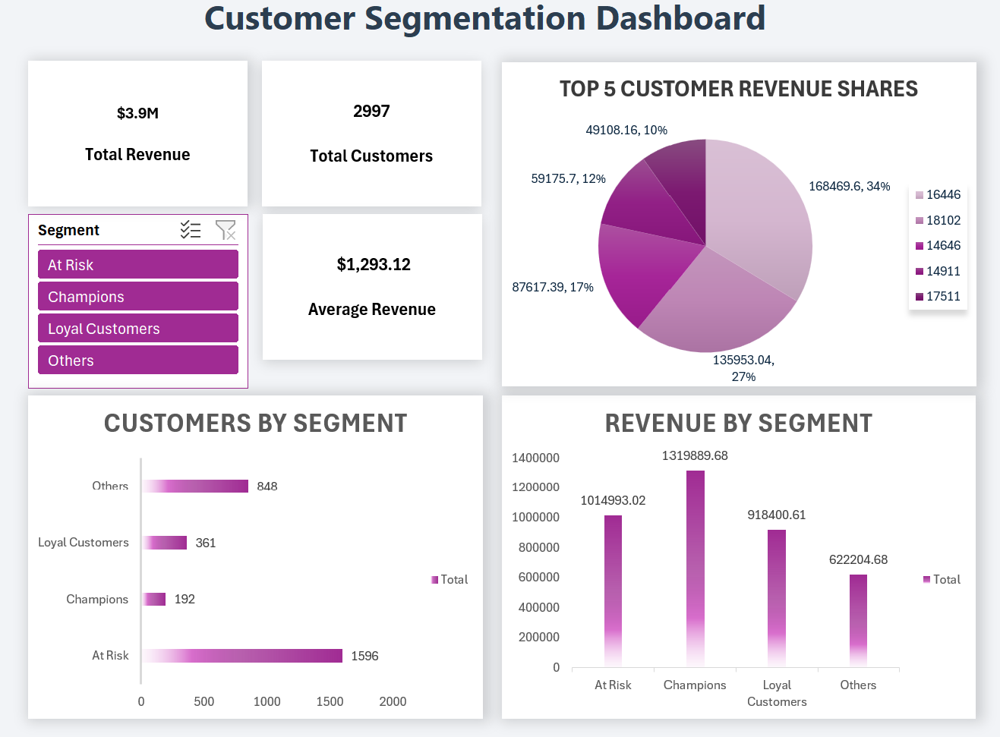

# 📊 Customer Segmentation Dashboard (Excel)

## 📌 Overview
This project analyzes customer purchasing behavior using **RFM (Recency, Frequency, Monetary) analysis** and presents insights through an interactive Excel dashboard.

The goal is to identify high-value customers, understand revenue distribution, and highlight opportunities for improving customer retention.

---

## 🛠️ Tools & Techniques
- Microsoft Excel  
- Pivot Tables  
- Data Cleaning  
- RFM Analysis  
- Data Visualization  

---

## 📈 Dashboard Features
- KPI Cards (Total Revenue, Total Customers, Avg Revenue)  
- Customer Segmentation (Champions, Loyal, At Risk, Others)  
- Revenue Distribution by Segment  
- Customer Distribution by Segment  
- Interactive Slicer for dynamic filtering  

---

## 📷 Dashboard Preview

---

## 💡 Key Insights
- Champions contribute the majority of revenue  
- At Risk customers form a significant portion of the customer base  
- Opportunity to improve retention and convert At Risk customers into Loyal customers  

---

## 📂 Dataset
Dataset sourced from Kaggle:  
https://www.kaggle.com/datasets/vijayuv/onlineretail

---

## 👤 Author
**Lakshya Sharma**  
- 🔗 LinkedIn: https://www.linkedin.com/in/slakshya22/  
- 💻 GitHub: https://github.com/slakshya-22  

---

## 🚀 Conclusion
This project demonstrates how Excel can be used for end-to-end data analysis — from data cleaning to building an interactive business dashboard.
